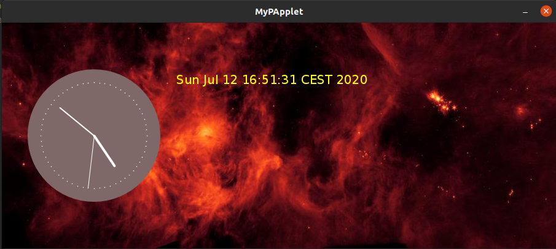

## Java Project: drawing clocks using PApplet

This is an exercise to get use with GUI. In this project, a canvas is created and loaded with a background image, an analog and a digital clocks are added.

    
    
Plot of clocks. 

## Reference 
Coursera: Object Oriented Programming in Java  
https://processing.org/examples/clock.html
